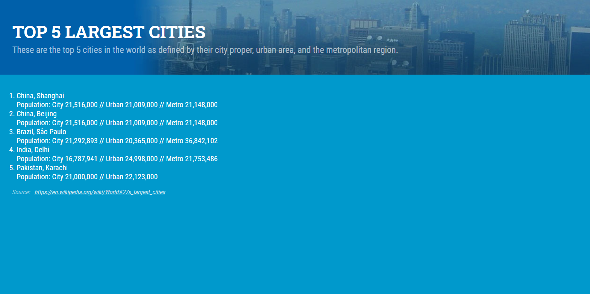
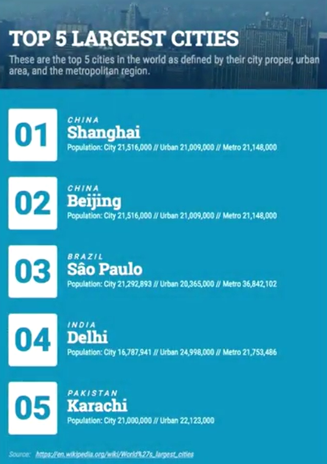

# Styling a numbered list with Pseudo Elements

Style the current site to look like the end image refernce using pseudo elements and the content property.

- It doesn't necessarily have to be responsive, I just cropped the ending image too much :poop:.

Useful links:

- [MDN Content Property](http://google.com)

- [MDN Counter Property](https://developer.mozilla.org/en-US/docs/Web/CSS/counter)

_Beginning_

_End_

